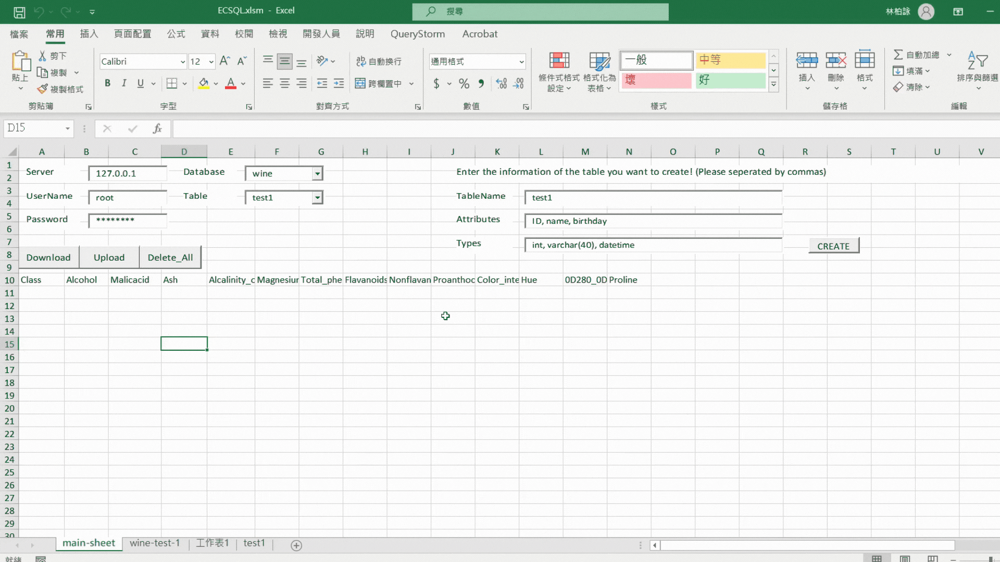
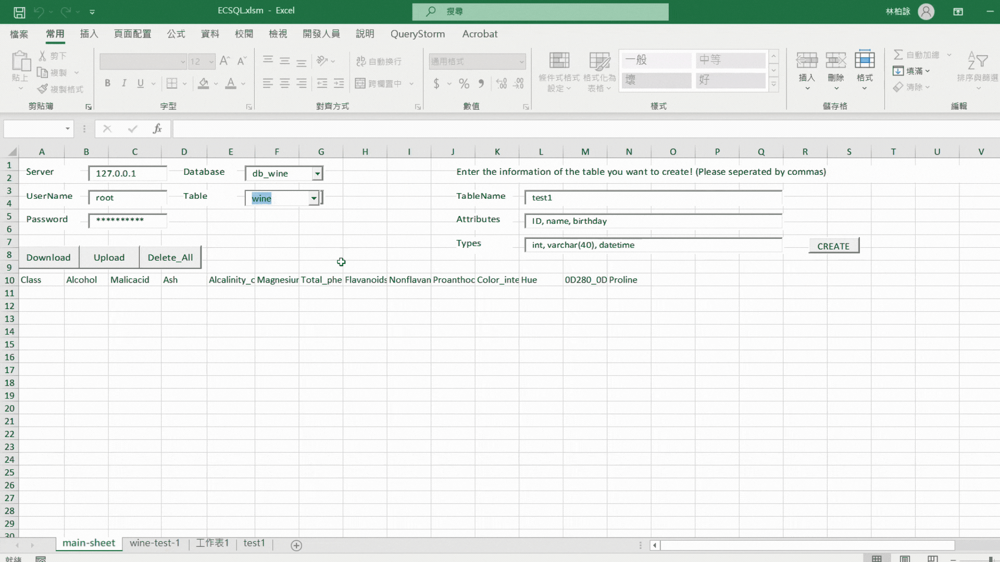
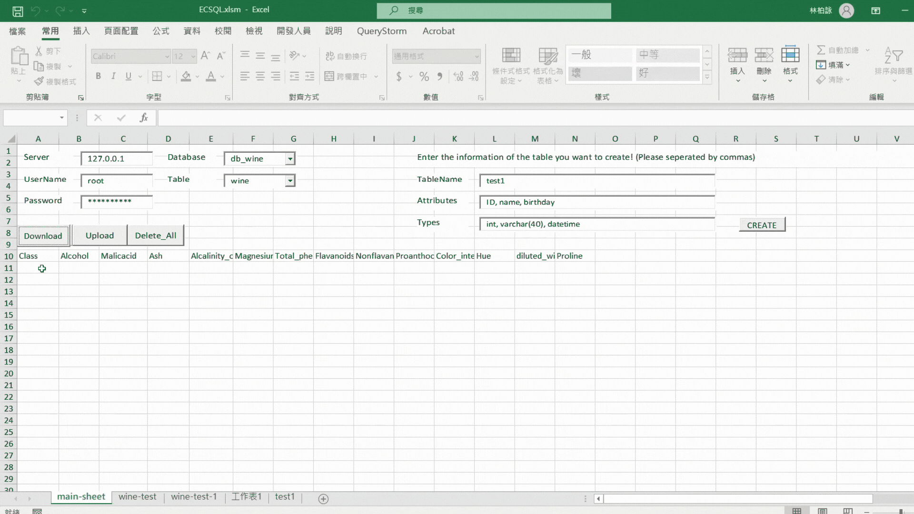

# ECSQL: Access databases with one button
> This is our final project for conclude the NTU 111-2 DBMS course.

---

## Abstract


## Feature
| Connect MySQL |
| :---: |
|  |

| Create Table |
| :---: |
|  |

| Upload Data & Analysis Results |
| :---: |
|  |

| Download Table |
| :---: |
|  |

## Framework
- Excel VBA
- Python
- MySQL

## Structure
```
code
├─ Package
│  ├─ config.json
│  ├─ ECSQL.xlsm
│  ├─ example.py
│  ├─ JsonConverter.bas
│  ├─ kNN.py
│  ├─ PCA.py
│  ├─ README.md
│  └─ worksheet1.cls
└─ UCI
   ├─ dry-bean-data.csv
   ├─ iris-data.csv
   └─ wine-data.csv
```
