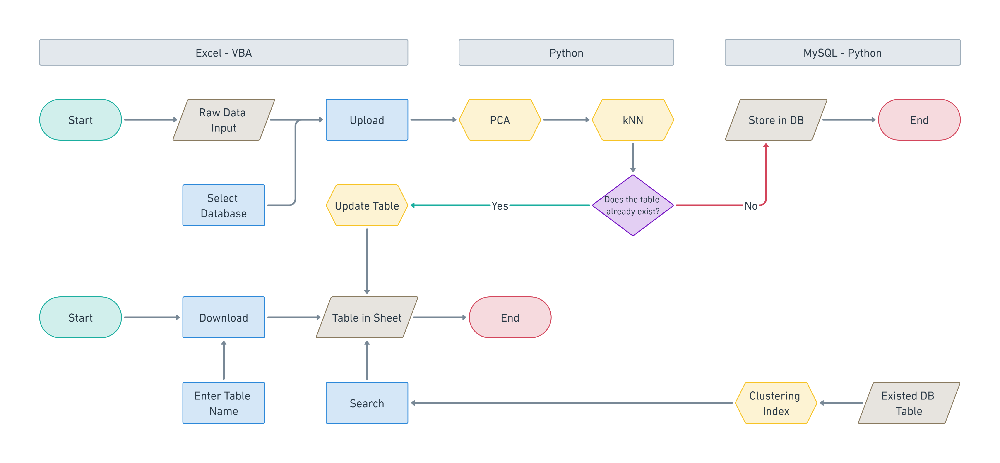

# ECSQL: Access databases with one button
> This is our final project to conclude the NTU 111-2 DBMS course.
> LIN BO-YONG, KUO TING-YI, TSENG YU-HSUAN, ZHANG YU-JIE
---

## Abstract
This process aims to offer users a seamless and efficient method for managing and analyzing their data. By utilizing Principal Component Analysis (PCA) and k-Nearest Neighbors (kNN) algorithms, the input data transform, resulting in a lower-dimensional representation that preserves the crucial characteristics of the data. Following this, the kNN algorithm is employed to classify data instances and assign clustering indices, enabling the identification of data groups with similar characteristics.

This process empowers users to gain valuable insights from their data by providing a streamlined approach to data handling and analysis. Through the application of PCA, the input data is condensed into a concise representation that captures the most significant aspects. Subsequently, the kNN algorithm is employed to categorize the data instances and assign clustering indices, simplifying the identification of data clusters with shared characteristics.
By adopting this approach, users can effectively analyze their data, make informed decisions, and uncover meaningful patterns. The utilization of PCA and kNN algorithms enhances the efficiency and accuracy of data analysis, enabling users to extract valuable knowledge from their datasets.

In summary, this process offers users an optimized methodology for data management and analysis. Leveraging PCA and kNN algorithms enables efficient data transformation, classification, and clustering, ultimately facilitating the identification of similar data groups and enhancing the understanding of the underlying patterns in the dataset.

## Workflow


## Feature
| Connect MySQL |
| :---: |
|  |

| Create Table |
| :---: |
|  |

| Upload Data & Analysis Results |
| :---: |
|  |

| Download Table |
| :---: |
|  |

| Principal Components         | PC1   | PC2  | PC3  |
|:---------------------------- |:----- |:---- |:---- |
| Explained Variance Ratio (%) | 99.81 | 0.17 | 0.01 |

|     | Training Accuracy | Testing Accuracy |
|:--- |:----------------- |:---------------- |
| kNN | 0.81              | 0.67             |

## Framework
- Excel VBA
- Python
- MySQL

## Structure
```
code
├─ Package
│  ├─ config.json
│  ├─ ECSQL.xlsm
│  ├─ example.py
│  ├─ kNN.py
│  ├─ PCA.py
│  ├─ auto_create_table.py
│  ├─ JsonConverter.bas
│  └─ worksheet1.cls
└─ UCI
   ├─ dry-bean-data.csv
   ├─ iris-data.csv
   └─ wine-data.csv
```
